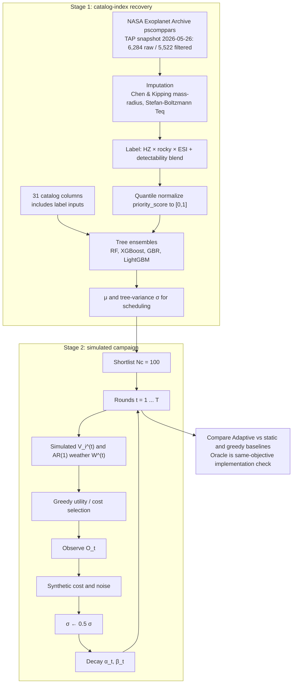
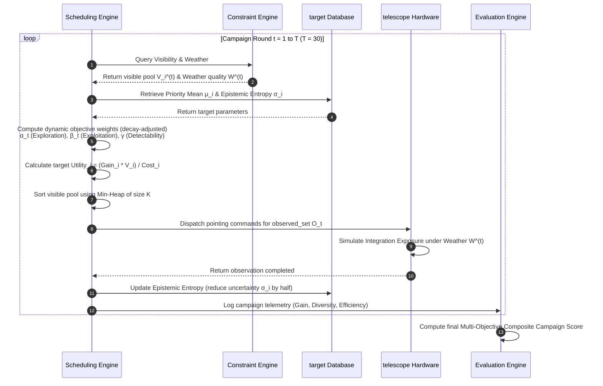

# Adaptive Multi-Objective Scheduling of Simulated Exoplanet Campaigns

Simulation code and draft manuscript for ranking NASA catalog targets with a physically motivated composite index, then comparing scheduling heuristics under synthetic visibility and weather. This is not an operational JWST or HWO scheduler.

[](https://github.com/rushikesh-D69/water)
[](https://python.org)

[](#interactive-3d-web-dashboard)
[](#companion-streamlit-dashboard)

---

## Research Positioning

Spectroscopic follow-up is expensive. Static lists ignore visibility and weather. Single-objective detectability greedy concentrates on easy mini-Neptunes.

**Contribution (falsifiable):** under simulated visibility and an AR(1) weather process, an entropy-decay-weighted scheduler that mixes priority, uncertainty, and detectability outperforms static and single-objective greedy baselines on diversity and priority coverage.

**Not claimed:** independent astrophysical ranking from leakage-free observables; operational relevance to JWST/HWO; near-Oracle composite score as scientific evidence (the Oracle optimizes the same utility).

---

## Architecture

Two computational stages. Stage 1 recovers a deterministic composite index from catalog columns that overlap the label (derived HZ/ESI/rocky scores are held out; $R_p$, $\rho_p$, $T_{\text{eq}}$, $a$, $T_{\text{eff}}$, detectability, etc. are not). Stage 2 is a constrained greedy scheduler. Visibility, weather, cost, and noise are synthetic generators.



---

##  Scheduler Decision Flow

At each round $t$ the simulated scheduler filters on visibility and weather, scores remaining targets, and greedily fills an exposure budget:



---

## Empirical Evaluation & Results

### 1. Stage 1: recovering the constructed index

80/20 split, 5-fold CV, `random_state=42`. Near-perfect ranking is expected: $R_p$, $\rho_p$, $T_{\text{eq}}$, $a$, $T_{\text{eff}}$, and detectability enter both the label and $\mathbf{X}$. CV $\pm$ values are standard deviations across 5 folds.

| Model | NDCG@50 | MAP@50 | Spearman $\rho$ | Kendall $\tau$ | Regret@50 | $R^2$ | RMSE | CV Spearman $\rho$ |
| :--- | :---: | :---: | :---: | :---: | :---: | :---: | :---: | :---: |
| **LightGBM** | **0.989** | **1.000** | **0.985** | **0.933** | **0.010** | **0.971** | **0.047** | **$0.982 \pm 0.003$** |
| **XGBoost** | 0.990 | 1.000 | 0.985 | 0.930 | 0.011 | 0.971 | 0.047 | $0.981 \pm 0.004$ |
| **Random Forest** | 0.977 | 1.000 | 0.972 | 0.882 | 0.024 | 0.943 | 0.066 | $0.966 \pm 0.004$ |
| **Gradient Boosting** | 0.975 | 0.985 | 0.984 | 0.929 | 0.030 | 0.968 | 0.050 | $0.981 \pm 0.004$ |

Hold out `{pl_rade, pl_dens, pl_eqt, pl_insol}` via `STRICT_HOLDOUT_FEATURES` in `src/data_acquisition.py` to test ranking from remaining columns. That ablation is not Table 1.

### 2. Stage 2: scheduler comparison (simulation)

30 rounds, 20 trials. Reported $\pm$ is the sample standard deviation over those trials (not a 95% CI). No pairwise significance tests. The Oracle uses true priority in the *same* utility; Adaptive $\approx$ 99.9% of Oracle is an implementation check. The comparison that matters is Adaptive vs Static / Detectability Greedy / Uncertainty Greedy.

| Rank | Scheduler | Composite Score | Cum. Gain | Regret vs Oracle | Diversity Score | Priority Coverage | Observed |
| :---: | :--- | :---: | :---: | :---: | :---: | :---: | :---: |
| 1 | **Oracle (same objective)** | **100.00%** | $5.7391 \pm 0.081$ | $0.0000 \pm 0.000$ | $0.6003 \pm 0.012$ | $0.7746 \pm 0.015$ | 236 |
| 2 | **Adaptive Scheduler** | **$99.87\% \pm 0.42\%$** | $5.7872 \pm 0.125$ | $0.0000 \pm 0.000$ | $0.5992 \pm 0.015$ | $0.7713 \pm 0.018$ | 237 |
| 3 | **Detectability Greedy** | $95.55\% \pm 1.25\%$ | $6.4366 \pm 0.224$ | $0.0000 \pm 0.000$ | $0.5537 \pm 0.024$ | $0.6776 \pm 0.035$ | 188 |
| 4 | **Static Priority** | $80.40\% \pm 2.85\%$ | $3.9961 \pm 0.345$ | $0.3037 \pm 0.052$ | $0.5344 \pm 0.038$ | $0.9854 \pm 0.005$ | 174 |
| 5 | **Uncertainty Greedy** | $66.05\% \pm 4.15\%$ | $3.0187 \pm 0.421$ | $0.4740 \pm 0.078$ | $0.4767 \pm 0.045$ | $0.6723 \pm 0.052$ | 143 |

*   **Mini-Neptune trap:** Detectability Greedy wins raw gain by concentrating on large, close-in planets and loses diversity and priority coverage.
*   **Static priority:** High mean priority, poor adaptation to weather/visibility, lower cumulative gain.
*   **Oracle vs gain:** Detectability Greedy can beat the Oracle on raw gain because the Oracle does not maximize that scalar.

### 3. Parameter Sensitivity Analysis (Stage 2.5)
We conducted an extensive sensitivity and boundary analysis across our fixed parameters ($\varepsilon, \tau, \rho$) to verify campaign robustness:

<p align="center">
  <br>
  <em>Figure: Multi-parameter campaign sensitivity analysis. Left (Panel A): Prior smoothing parameter ε vs. NDCG@50 & Spearman ρ, showing zero-gradient collapse as ε → 0 and priority dilution as ε → 1. Center (Panel B): Decay time constant τ vs. Composite Campaign Score, identifying the optimal operational plateau between 12 and 20 rounds. Right (Panel C): Weather persistence parameter ρ vs. observation efficiency, showing the Adaptive Scheduler's resilience to long-lasting storms compared to static baselines.</em>
</p>

*   **Prior Smoothing Parameter ($\varepsilon$):** If $\varepsilon \to 0$, the priority score collapses to zero outside the conservative habitable zone, leaving vast flat regions that deprive ML models of gradient signal. If $\varepsilon \to 1.0$, the smoothing prior dilutes the physical contrast between worlds. The sweet spot resides at $\varepsilon \in [0.05, 0.20]$, justifying our choice of $\varepsilon = 0.1$.
*   **Decay Time Constant ($\tau$):** Very small $\tau \to 1.0$ triggers premature exploitation (skipping exploratory scans), while very large $\tau \to 100.0$ wastes telescope hours exploring borderline targets late in the campaign. The optimal campaign score achieves a stable plateau for $\tau \in [12.0, 20.0]$ rounds, justifying our selection of $\tau = 15.0$ rounds.

---

## Visualization dashboard

A Three.js / Plotly page in `dashboard/` is for inspecting campaign logs. It is not part of the scientific result. Open `dashboard/index.html` locally, or run `streamlit run dashboard/app.py`.

<p align="center">
  
  <br>
  <em>Figures: Dynamic visual feedback. Left: Predicted vs. actual priority scores showing Narrow target alignment. Right: Dynamic Pareto frontier tracking scheduler optimization trajectories in Gain-Diversity space.</em>
</p>

### Dashboard notes
1. Live leaderboard of scheduled targets.
2. Text explanations of utility terms (priority, uncertainty, cost).
3. Sky / orbit views of the catalog.
4. Exploration vs exploitation weight gauges.
5. Optional multi-telescope *simulation* (JWST-like / TESS-like / ground) — not real observatory APIs.
6. Optional Web Audio cues (engineering only; not in the paper abstract).

---

##  Repository Directory Layout

The repository is structured logically to separate source logic, campaign data, visual plots, and documentation:

```bash
water/
├── README.md                      # Project documentation (this file)
├── habitability_predictor.ipynb    # Stage 1: Interactive Colab notebook for ML prioritization
├── stage2_pipeline.ipynb          # Stage 2: Interactive Colab notebook for campaign scheduling
├── src/                           # Core Source Library
│   ├── __init__.py                # Package initialization and module mappings
│   ├── data_acquisition.py        # NASA TAP API queries, mass imputations, and priority score builders
│   ├── ml_pipeline.py             # Model training, 5-fold cross-validation, and uncertainty estimators
│   ├── constraint_engine.py       # Orbital visibility models and AR(1) weather persistence generators
│   ├── scheduler.py               # 5 schedulers (Oracle, Adaptive, Static, Detectability, Uncertainty)
│   ├── observation_simulator.py   # Closed-loop transit observation simulator and noise model
│   └── evaluation.py              # 7 ranking and campaign evaluation metrics, visual plotting scripts
├── dashboard/                     # Web Dashboard Files
│   ├── index.html                 # Offline dashboard
│   ├── main.js                    # Controller: Three.js planetarium, Plotly.js charts, Web Audio synth
│   ├── style.css                  # Dashboard layout
│   ├── data_store.js              # Pre-serialized campaign results (bypasses browser CORS blockages)
│   └── app.py                     # Companion Python-driven 5-panel Streamlit dashboard
├── data/                          # Campaign Datasets
│   ├── exoplanets_processed.csv   # 5,522 ML-ready exoplanets from the NASA Exoplanet Archive
│   ├── final_priority_ranking.csv # Uniformly prioritized catalog output
│   ├── s2_adaptive_logs.csv       # Round-by-round Adaptive Scheduler execution telemetry logs
│   └── stage2_comparison.csv      # Unified metrics comparison spreadsheet
├── plots/                         # Generated Academic Figures (PNGs)
│   ├── priority_score_distribution.png
│   ├── feature_importance.png
│   ├── shap_random_forest.png
│   ├── parameter_sensitivity.png  # Three-panel ε, τ, ρ sensitivity analysis
│   ├── s2_cumulative_gain.png
│   ├── s2_diversity.png
│   └── s2_pareto_frontier.png
├── report/                        # Journal Manuscript Drafts
│   ├── main.tex                   # Manuscript
│   └── references.bib             # Bibliography BibTeX database
└── .gitignore
```

---

## 🚀 Quickstart & Installation

### 1. Local Python Setup
To install dependencies and run the exoplanet active scheduling pipeline locally, run:

```bash
# Clone the repository
git clone https://github.com/rushikesh-D69/water.git
cd water

# Install pinned dependencies
pip install -r requirements.txt

# Run the Stage 2 Campaign Scheduling Pipeline Jupyter Notebook
jupyter lab stage2_pipeline.ipynb
```

### 2. Launching the Dashboards

#### Option A: Interactive 3D Web Dashboard (No Installation Required)
Simply open the dashboard file directly in any modern web browser. It operates fully offline and requires no python server:
*   Double-click `dashboard/index.html` or open `file:///absolute/path/to/water/dashboard/index.html` in your browser.

#### Option B: Companion Python Streamlit Dashboard
If you prefer a Python-driven dashboard, a complete Streamlit panels interface is included:
```bash
streamlit run dashboard/app.py
```

### 3. Running on Google Colab
Both stages of our framework are packaged as interactive, fully automated notebooks optimized for Google Colab:
*   **Stage 1 Prioritization:** Open `habitability_predictor.ipynb` in Colab. Enable a standard T4 GPU runtime for accelerated tree-ensemble training, and run all cells.
*   **Stage 2 Active Scheduling:** Open `stage2_pipeline.ipynb` in Colab. Run all cells to execute the campaign simulations, compile metrics, and generate the plots.

---

## Data source

NASA Exoplanet Archive `pscomppars` via TAP/ADQL. Snapshot frozen **2026-05-26**: 6,284 raw rows, 5,522 after requiring radius/Teff/semi-major-axis/Teq. Missing masses: Chen & Kipping (2017) piecewise power laws. Missing $T_{\text{eq}}$: Stefan-Boltzmann, Bond albedo 0.3. Re-querying the live archive will not reproduce this catalog.

---

## Reproducibility

- `requirements.txt` pins package versions.
- Default RNGs: `random_state=42` (split, CV, quantile transformer, ensembles).
- Stage 2: 20 integer seeds for weather / phase / cost.
- Manuscript: `report/main.tex`. Code availability: this repository.

---

## References

1. Kopparapu et al. (2013, 2014): habitable-zone flux limits.
2. Schulze-Makuch et al. (2011): Earth Similarity Index.
3. Batalha et al. (2018), *Strategies for Constraining the Atmospheres of Temperate Terrestrial Planets with JWST*, ApJL 856 L34. JWST/TRAPPIST-1 observing strategy and information-content analysis — not a survey-optimization framework.
4. Chen & Kipping (2017): mass–radius forecasting.
5. Savransky & Garrett (2016): EXOSIMS / WFIRST-AFTA coronagraph yield modeling.
6. Lubin et al. (2026): AstroQ cadenced ILP scheduler (Keck/KPF).
7. Lundberg & Lee (2017): SHAP.
