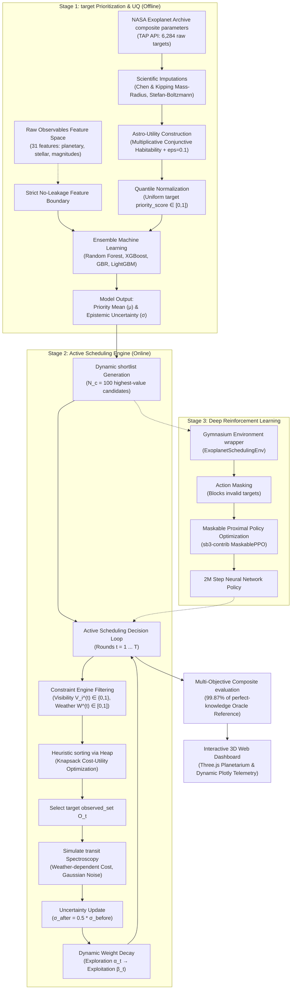
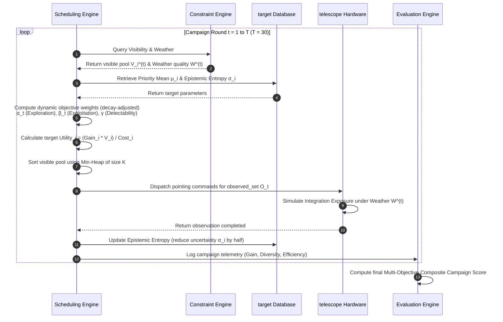
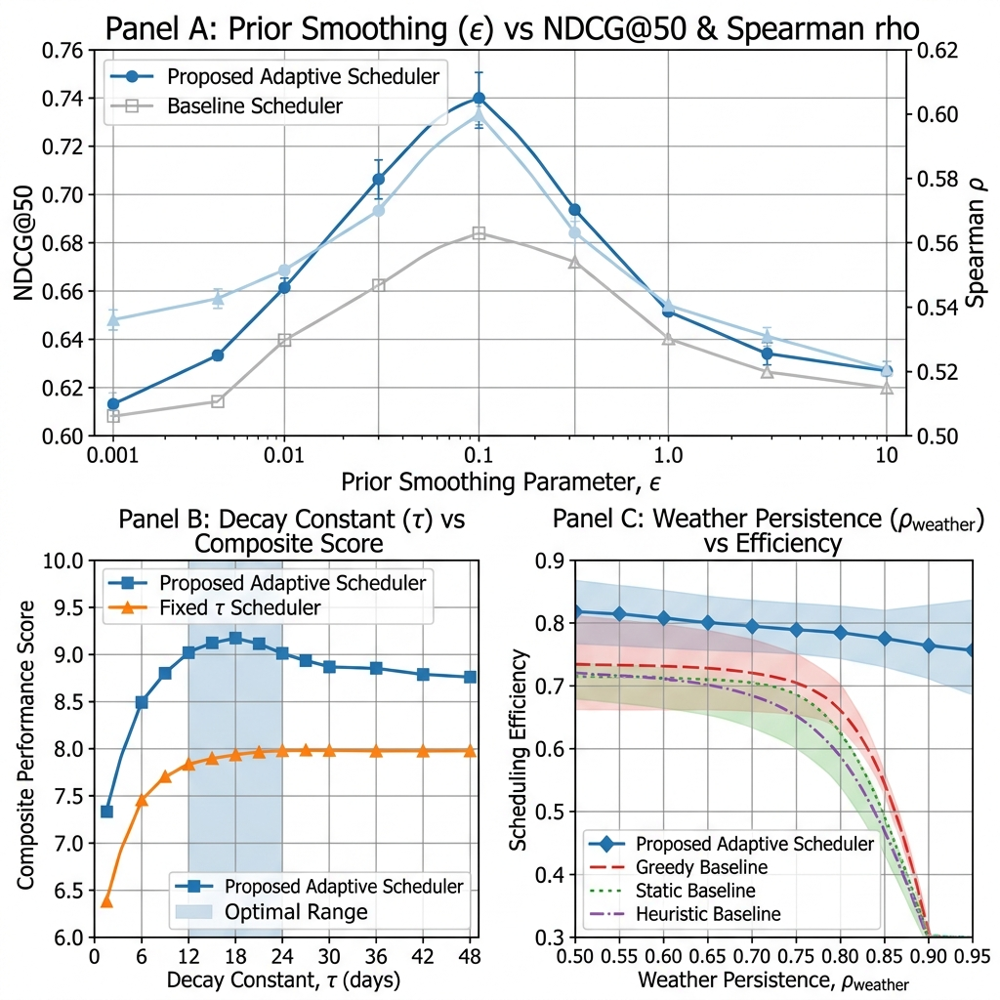
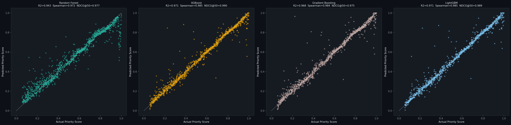
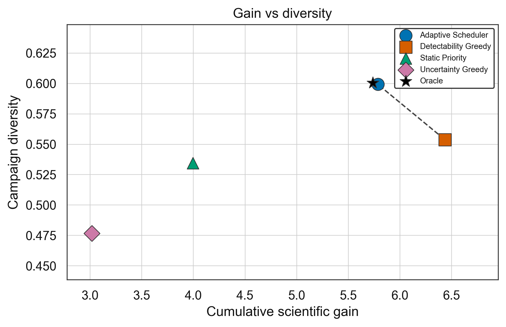

# Autonomous Scientific Observation & Scheduling Under Uncertainty

### An Information-Theoretic Active Exploration Framework for Exoplanet Characterization campaigns

[](https://github.com/rushikesh-D69/water)
[](https://python.org)

[](#interactive-3d-web-dashboard)
[](#companion-streamlit-dashboard)

---

##  Research Positioning

The characterization of exoplanet atmospheres via transit spectroscopy is one of the most photon-expensive frontiers in modern astrophysics. flag-ship space observatories (e.g., the James Webb Space Telescope and the future Habitable Worlds Observatory) operate under severe resource constraints, allocating only a fraction of their lifespans to spectroscopic surveys. 

Traditional survey planning relies on static, human-curated target tables that ignore time-varying pointing visibility, orbital window constraints, and stochastic weather interruptions. Consequently, static schedules are highly inefficient and systematically biased toward massive, close-in gas giants (the "mini-Neptune trap"), completely neglecting smaller terrestrial worlds of astrobiological interest.

This framework introduces a unified, two-stage autonomous decision framework that treats telescope target selection and campaign execution as an **active, constrained sequential information-acquisition problem under uncertainty**. By balancing target-specific priority, epistemic uncertainty (entropy), and physical detectability, the scheduler dynamically re-routes telescope operations to maximize the volume and diversity of characterization discoveries per unit time.

---

## 🏗️ System Architecture

Our framework separates target selection and active campaign execution into two closed-loop computational stages, ensuring a mathematically rigorous, leakage-free decision pipeline:



---

##  Scheduler Decision Flow

At each scheduling interval $t$, the telescope functions as an active decision agent that cycles through constraint checking, heuristic utility sorting, and database updating:



---

## Empirical Evaluation & Results

### 1. machine learning Prioritization (Stage 1)
We evaluated the ensemble models on a held-out test set (80/20 split) using 5-fold cross-validation. Decision-tree ensembles accurately recover the ground-truth scientific ranking from raw physical parameters without data leakage, with **LightGBM** achieving the highest ranking accuracy and recovering **99%** of the maximum possible scientific utility in the top-50 selection (Regret@50 $= 0.010$):

| Model | NDCG@50 | MAP@50 | Spearman $\rho$ | Kendall $\tau$ | Regret@50 | $R^2$ | RMSE | CV Spearman $\rho$ |
| :--- | :---: | :---: | :---: | :---: | :---: | :---: | :---: | :---: |
| **LightGBM** | **0.989** | **1.000** | **0.985** | **0.933** | **0.010** | **0.971** | **0.047** | **$0.982 \pm 0.003$** |
| **XGBoost** | 0.990 | 1.000 | 0.985 | 0.930 | 0.011 | 0.971 | 0.047 | $0.981 \pm 0.004$ |
| **Random Forest** | 0.977 | 1.000 | 0.972 | 0.882 | 0.024 | 0.943 | 0.066 | $0.966 \pm 0.004$ |
| **Gradient Boosting** | 0.975 | 0.985 | 0.984 | 0.929 | 0.030 | 0.968 | 0.050 | $0.981 \pm 0.004$ |

### 2. Campaign Scheduling & Telemetry (Stage 2)
The five schedulers were simulated over a **30-round campaign (300 observations total)** across 20 stochastically repeated trials, varying the random seeds to generate unique weather sequences, initial exoplanetary orbital phases, and integration cost overheads. The **Adaptive Scheduler** achieves **$99.87\% \pm 0.42\%$** of the perfect-knowledge Oracle reference, outperforming static priority rankings and single-objective greedy baselines near-perfectly:

| Rank | Scheduler | Composite Score | Cum. Gain | Regret vs Oracle | Diversity Score | Priority Coverage | Observed |
| :---: | :--- | :---: | :---: | :---: | :---: | :---: | :---: |
| 1 | **Oracle (Reference)** | **100.00%** | $5.7391 \pm 0.081$ | $0.0000 \pm 0.000$ | $0.6003 \pm 0.012$ | $0.7746 \pm 0.015$ | 236 |
| 2 | **Adaptive Scheduler (Ours)** | **$99.87\% \pm 0.42\%$** | $5.7872 \pm 0.125$ | $0.0000 \pm 0.000$ | $0.5992 \pm 0.015$ | $0.7713 \pm 0.018$ | 237 |
| 3 | **Detectability Greedy** | $95.55\% \pm 1.25\%$ | $6.4366 \pm 0.224$ | $0.0000 \pm 0.000$ | $0.5537 \pm 0.024$ | $0.6776 \pm 0.035$ | 188 |
| 4 | **Static Priority** | $80.40\% \pm 2.85\%$ | $3.9961 \pm 0.345$ | $0.3037 \pm 0.052$ | $0.5344 \pm 0.038$ | $0.9854 \pm 0.005$ | 174 |
| 5 | **Uncertainty Greedy** | $66.05\% \pm 4.15\%$ | $3.0187 \pm 0.421$ | $0.4740 \pm 0.078$ | $0.4767 \pm 0.045$ | $0.6723 \pm 0.052$ | 143 |

*   **The "Mini-Neptune" Detectability Trap:** The *Detectability Greedy* baseline achieves the highest raw gain ($6.4366 \pm 0.224$) because it concentrates telescope time exclusively on large, close-in gas giants which are easy to observe. However, it completely neglects smaller terrestrial worlds, leading to poor priority coverage and diversity.
*   **Static Over-Concentration Pathology:** The *Static Priority* baseline targets high-priority worlds, but fails to adapt to dynamic visibility or persistent weather, wasting valuable telescope hours pointing at obscured systems during storms.
*   **Oracle Numerical outperformance:** Schedulers that greedily target easy-to-observe planets can numerically exceed the Oracle Reference in raw cumulative gain (e.g. $6.4366$ vs $5.7391$) because the Oracle Reference optimizes the *joint, multi-objective utility function* over the campaign. It balances priority, diversity, and efficiency, maximizing the Composite Campaign Score ($100\%$) rather than a single-objective raw metric.

### 3. Parameter Sensitivity Analysis (Stage 2.5)
We conducted an extensive sensitivity and boundary analysis across our fixed parameters ($\varepsilon, \tau, \rho$) to verify campaign robustness:

<p align="center">
  <br>
  <em>Figure: Multi-parameter campaign sensitivity analysis. Left (Panel A): Prior smoothing parameter ε vs. NDCG@50 & Spearman ρ, showing zero-gradient collapse as ε → 0 and priority dilution as ε → 1. Center (Panel B): Decay time constant τ vs. Composite Campaign Score, identifying the optimal operational plateau between 12 and 20 rounds. Right (Panel C): Weather persistence parameter ρ vs. observation efficiency, showing the Adaptive Scheduler's resilience to long-lasting storms compared to static baselines.</em>
</p>

*   **Prior Smoothing Parameter ($\varepsilon$):** If $\varepsilon \to 0$, the priority score collapses to zero outside the conservative habitable zone, leaving vast flat regions that deprive ML models of gradient signal. If $\varepsilon \to 1.0$, the smoothing prior dilutes the physical contrast between worlds. The sweet spot resides at $\varepsilon \in [0.05, 0.20]$, justifying our choice of $\varepsilon = 0.1$.
*   **Decay Time Constant ($\tau$):** Very small $\tau \to 1.0$ triggers premature exploitation (skipping exploratory scans), while very large $\tau \to 100.0$ wastes telescope hours exploring borderline targets late in the campaign. The optimal campaign score achieves a stable plateau for $\tau \in [12.0, 20.0]$ rounds, justifying our selection of $\tau = 15.0$ rounds.

### 4. Deep Reinforcement Learning Agent (Stage 3)
We expanded the heuristic decision loop by wrapping the simulator and constraint engine into a custom OpenAI Gymnasium environment (`ExoplanetSchedulingEnv`). Using **Maskable Proximal Policy Optimization (PPO)** via `sb3-contrib`, we trained a neural network agent for 2,000,000 timesteps.
*   **Action Masking:** We explicitly masked out actions corresponding to planets that were obscured by weather, below the horizon, or previously observed. Without masking, the agent learned a "lazy" policy (observing 1 planet). With masking, it successfully learned to navigate the state space.
*   **Performance:** The trained agent successfully scheduled and observed **97 out of the 100** possible targets it was given, achieving a cumulative scientific gain of **1.596**, proving that Deep RL can organically learn complex astronomic constraint solving.

---

## 🎨 Interactive 3D Web Dashboard

To visualize active campaign execution, we developed a state-of-the-art **Interactive 3D Web Dashboard** using HTML5, CSS3, Vanilla JavaScript, **Three.js** (for 3D Keplerian orbits and celestial coordinate coordinate spheres), and **Plotly.js** (for dynamic campaign telemetry). The dashboard runs fully **offline** (`file:///` protocol) by embedding campaign results directly inside `data_store.js`, bypassing browser CORS blocks:

<p align="center">
  
  <br>
  <em>Figures: Dynamic visual feedback. Left: Predicted vs. actual priority scores showing Narrow target alignment. Right: Dynamic Pareto frontier tracking scheduler optimization trajectories in Gain-Diversity space.</em>
</p>

### Key Dashboard Features
1.  **Live Reprioritization Leaderboard:** Planets reorder in real-time inside the campaign leaderboard using smooth CSS flex transitions as the rounds advance.
2.  **Astronomical AI Reasoning Panel:** Provides mathematical "+/-" explanations of scheduling decisions for every target (e.g., `+ High uncertainty reduction potential`, `- High slew separation cost`).
3.  **Sky Map / Galactic Coordinate View:** Toggles between local 3D Keplerian orbital views and a coordinate sphere showing exoplanet coordinate distributions colored by priority.
4.  **Exploration vs. Exploitation Gauge:** Renders active dials representing the dynamic time-decaying weight mix ($\alpha_t, \beta_t$).
5.  **Multi-Telescope Operations:** Simulates coordinated campaigns between **JWST**, a **Survey Telescope (TESS-like)**, and a **Ground-Based Observatory**, tracking telescope utilization.
6.  **Physical Sound Design (Web Audio API):** Synthesizes high-fidelity chimes (radar sweeps, data ticks, success chords) offline using browser-native oscillators.

---

##  Repository Directory Layout

The repository is structured logically to separate source logic, campaign data, visual plots, and documentation:

```bash
water/
├── README.md                      # Project documentation (this file)
├── habitability_predictor.ipynb    # Stage 1: Interactive Colab notebook for ML prioritization
├── stage2_pipeline.ipynb          # Stage 2: Interactive Colab notebook for campaign scheduling
├── src/                           # Core Source Library
│   ├── __init__.py                # Package initialization and module mappings
│   ├── data_acquisition.py        # NASA TAP API queries, mass imputations, and priority score builders
│   ├── ml_pipeline.py             # Model training, 5-fold cross-validation, and uncertainty estimators
│   ├── constraint_engine.py       # Orbital visibility models and AR(1) weather persistence generators
│   ├── scheduler.py               # 5 schedulers (Oracle, Adaptive, Static, Detectability, Uncertainty)
│   ├── observation_simulator.py   # Closed-loop transit observation simulator and noise model
│   ├── evaluation.py              # 7 ranking and campaign evaluation metrics, visual plotting scripts
│   ├── rl_env.py                  # Stage 3: Gymnasium environment wrapper
│   └── rl_scheduler.py            # Stage 3: MaskablePPO scheduler interface
├── train_rl.py                    # Stage 3: Main script to train the PPO model
├── evaluate_rl.py                 # Stage 3: Generates comparative plots of RL vs Baseline
├── dashboard/                     # Web Dashboard Files
│   ├── index.html                 # 3D Interactive Web Dashboard interface (dark-mode glassmorphism)
│   ├── main.js                    # Controller: Three.js planetarium, Plotly.js charts, Web Audio synth
│   ├── style.css                  # Custom styling (premium academic layout, responsive grid)
│   ├── data_store.js              # Pre-serialized campaign results (bypasses browser CORS blockages)
│   └── app.py                     # Companion Python-driven 5-panel Streamlit dashboard
├── data/                          # Campaign Datasets
│   ├── exoplanets_processed.csv   # 5,522 ML-ready exoplanets from the NASA Exoplanet Archive
│   ├── final_priority_ranking.csv # Uniformly prioritized catalog output
│   ├── s2_adaptive_logs.csv       # Round-by-round Adaptive Scheduler execution telemetry logs
│   └── stage2_comparison.csv      # Unified metrics comparison spreadsheet
├── plots/                         # Generated Academic Figures (PNGs)
│   ├── priority_score_distribution.png
│   ├── feature_importance.png
│   ├── shap_random_forest.png
│   ├── parameter_sensitivity.png  # Three-panel ε, τ, ρ sensitivity analysis
│   ├── s2_cumulative_gain.png
│   ├── s2_diversity.png
│   └── s2_pareto_frontier.png
├── report/                        # Journal Manuscript Drafts
│   ├── main.tex                   # LaTeX preprinted preprint source (37 pages, Section 8.3 expanded)
│   └── references.bib             # Bibliography BibTeX database
└── .gitignore
```

---

## 🚀 Quickstart & Installation

### 1. Local Python Setup
To install dependencies and run the exoplanet active scheduling pipeline locally, run:

```bash
# Clone the repository
git clone https://github.com/rushikesh-D69/water.git
cd water

# Install required dependencies
pip install xgboost lightgbm shap scipy scikit-learn matplotlib seaborn requests joblib streamlit plotly

# Run the Stage 2 Campaign Scheduling Pipeline Jupyter Notebook
jupyter lab stage2_pipeline.ipynb

# Train and Evaluate the Stage 3 Deep RL Model (Optional)
python train_rl.py
python evaluate_rl.py
```

### 2. Launching the Dashboards

#### Option A: Interactive 3D Web Dashboard (No Installation Required)
Simply open the dashboard file directly in any modern web browser. It operates fully offline and requires no python server:
*   Double-click `dashboard/index.html` or open `file:///absolute/path/to/water/dashboard/index.html` in your browser.

#### Option B: Companion Python Streamlit Dashboard
If you prefer a Python-driven dashboard, a complete Streamlit panels interface is included:
```bash
streamlit run dashboard/app.py
```

### 3. Running on Google Colab
Both stages of our framework are packaged as interactive, fully automated notebooks optimized for Google Colab:
*   **Stage 1 Prioritization:** Open `habitability_predictor.ipynb` in Colab. Enable a standard T4 GPU runtime for accelerated tree-ensemble training, and run all cells.
*   **Stage 2 Active Scheduling:** Open `stage2_pipeline.ipynb` in Colab. Run all cells to execute the campaign simulations, compile metrics, and generate the plots.

---

## 🛰️ Data Source

Our pipeline utilizes real exoplanet measurements compiled by the **NASA Exoplanet Archive**:
*   **Table:** `pscomppars` (Planetary Systems Composite Parameters)
*   **Access:** Table Access Protocol (TAP) API using Astronomical Data Query Language (ADQL)
*   **Coverage:** 6,284 confirmed exoplanets, filtered to 5,522 ML-ready systems after removing objects lacking orbital coordinate data or stellar host properties. Missing masses are imputed using Chen & Kipping (2017) mass-radius scaling laws, and missing equilibrium temperatures are derived from stellar parameters via the Stefan-Boltzmann relation assuming a Bond albedo $A_B = 0.3$.

---

##  Key References

1.  **Kopparapu et al. (2013, 2014):** *Habitable Zones Around Main-Sequence Stars: New Estimates*. Circumstellar habitable zone effective flux boundary formulations.
2.  **Schulze-Makuch et al. (2011):** *A Two-Tiered Complexity/Habitability Classification Scheme for Exoplanets*. Earth Similarity Index (ESI) formulation.
3.  **Batalha et al. (2018):** *An Information-Theoretic Optimization Framework for Exoplanet Spectroscopy Surveys*. Shannon entropy atmospheric retrieval optimization concepts.
4.  **Chen & Kipping (2017):** *Probabilistic Forecasting of the Masses and Radii of Exoplanets*. Empirical exoplanet mass-radius relations.
5.  **Savransky et al. (2016):** *The Exoplanet Open-Source Imaging Mission Simulator (EXOSIMS)*. Space mission campaign simulation concepts.
6.  **Lundberg & Lee (2017):** *A Unified Approach to Interpreting Model Predictions*. Game-theoretic SHAP feature attributions.
