# Adaptive AI-Driven Telescope Target Prioritization Framework
### Probabilistic Liquid Water Detection on Exoplanets Under Observation Constraints

> **Research Paper Title:** *Adaptive Uncertainty-Aware Exoplanet Observation Scheduling Under Telescope Resource Constraints*

[](https://github.com/rushikesh-D69/water)
[](https://python.org)
[](#roadmap)
[](#interactive-3d-web-dashboard)
[](#streamlit-dashboard)

---

## Research Question

> *Can an AI-driven scheduler optimize exoplanet observation allocation more effectively than static prioritization approaches?*

Stage 1 answered: **"Which exoplanets are promising?"**
Stage 2 answers: **"Given limited telescope resources, which planets should be observed NEXT to maximize scientific gain?"**

---

## System Architecture

```
Stage 1 — Probabilistic Prioritization (Complete)
──────────────────────────────────────────────────
  NASA TAP API (6,284 planets)
      ↓
  Feature Engineering (31 features, leakage-free)
      ↓
  Weak Supervision Target: priority = (H+ε)^0.5 (R+ε)^0.3 (E+ε)^0.2
      ↓
  Ensemble ML: RF | XGBoost | GBM | LightGBM
      ↓
  Uncertainty: sigma_i = std(tree predictions)
      ↓
  Stage 1 Output: ranked priority scores + uncertainty map

Stage 2 — Adaptive Observation Scheduling Engine (Complete)
────────────────────────────────────────────────────────────
  Constraint Engine:     AR(1) weather, time budget, visibility, cost
      ↓
  Scientific Gain:       Gain = α_t·U + β_t·P + γ·D  (β decays over time)
      ↓
  5 Schedulers:          Static | Detectability | Uncertainty | Adaptive | Oracle
      ↓
  Observation Simulator: SNR + weather + detectability-dependent noise
      ↓
  Adaptive Loop:         30 rounds × 10 planets, uncertainty update, re-ranking
      ↓
  Evaluation:            Composite Campaign Score + 7 metrics + Oracle regret
      ↓
  3D Web Dashboard:      Three.js Planetarium & Dynamic Plotly Telemetry
```

---

## Novel Contributions

| Existing Systems | This Framework |
|-----------------|----------------|
| Habitability classification | **Dynamic reprioritization** each round |
| Static ML ranking | **Adaptive scheduler** with time-decaying exploration |
| No resource model | **AR(1) weather + time budget + switching cost** |
| No upper bound | **OracleScheduler** for absolute regret measurement |
| Simple ranking metrics | **Campaign Diversity Score** (5-dimensional) |
| No feedback loop | **Closed-loop adaptive astronomy** |

---

## Stage 1 Results

### ML Performance (5,522 Exoplanets)

| Model | NDCG@50 | Spearman ρ | Regret@50 | R² |
|-------|---------|------------|-----------|-----|
| LightGBM | **0.9890** | **0.9850** | **0.0096** | **0.9709** |
| XGBoost | 0.9905 | 0.9850 | 0.0106 | 0.9709 |
| Random Forest | 0.9770 | 0.9719 | 0.0244 | 0.9428 |
| Gradient Boosting | 0.9754 | 0.9836 | 0.0296 | 0.9640 |

### Stage 1 Plots

<table>
<tr>
<td>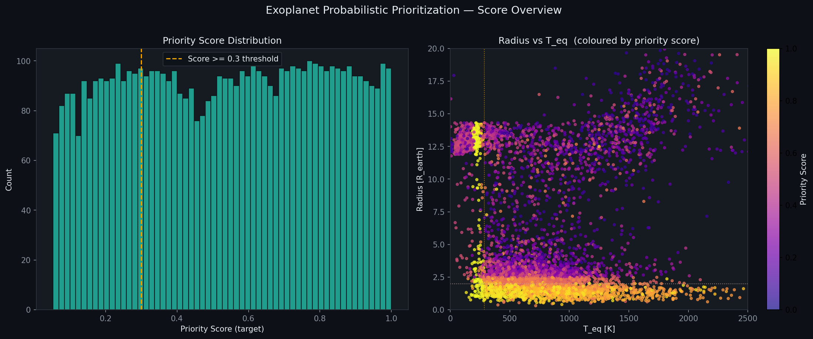<br><sub>Priority Score Distribution (quantile-normalized, uniform [0,1])</sub></td>
<td>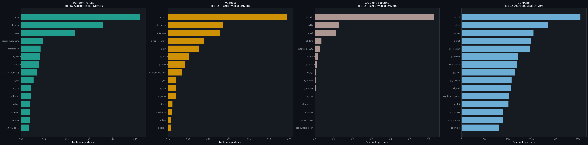<br><sub>Feature Importance — top 20 astrophysical drivers</sub></td>
</tr>
<tr>
<td>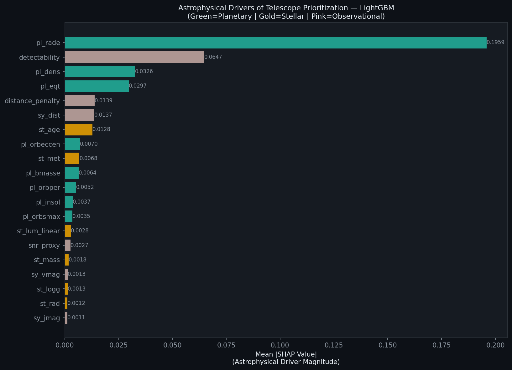<br><sub>SHAP Analysis — LightGBM (best model)</sub></td>
<td><br><sub>Predicted vs Actual Priority Score</sub></td>
</tr>
<tr>
<td>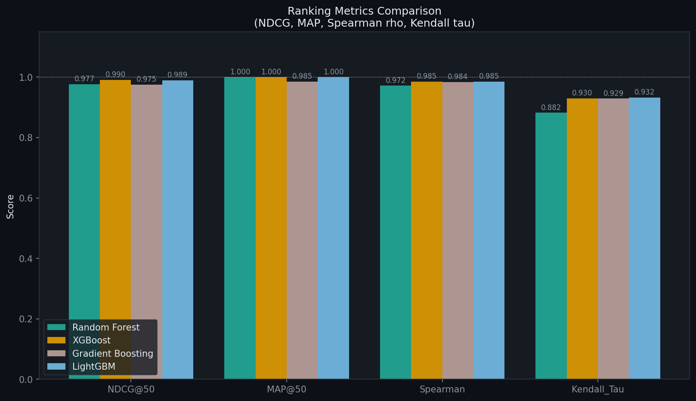<br><sub>Ranking Metrics Comparison (NDCG, Spearman, Kendall)</sub></td>
<td>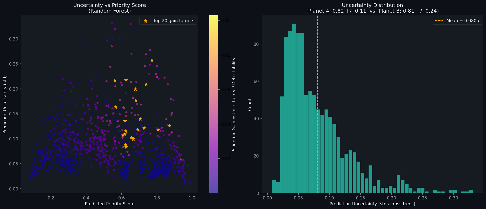<br><sub>Prediction Uncertainty Distribution (tree variance)</sub></td>
</tr>
<tr>
<td>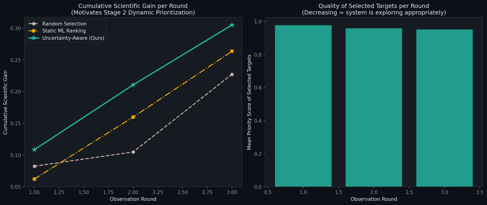<br><sub>Stage 1 Temporal Simulation — 3 rounds, uncertainty update</sub></td>
<td>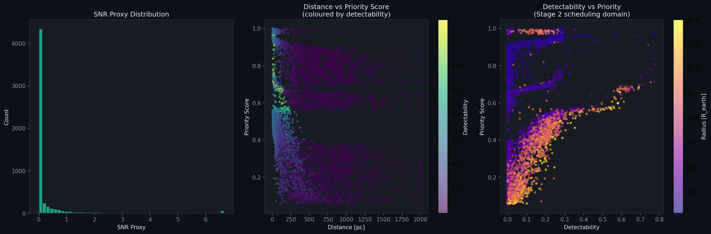<br><sub>Observability Analysis — detectability vs priority</sub></td>
</tr>
<tr>
<td>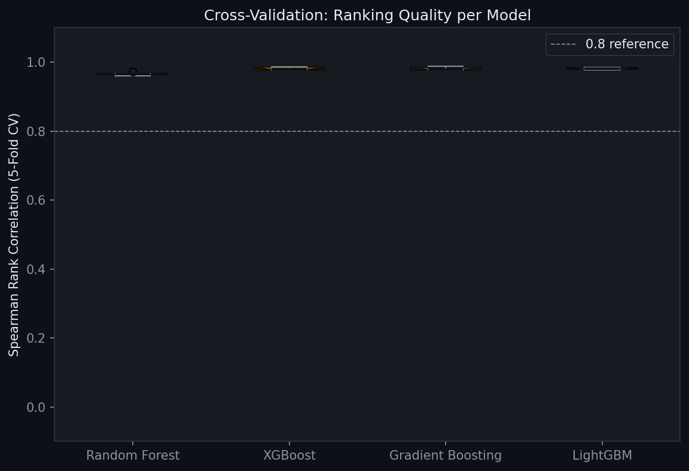<br><sub>Cross-Validation Spearman ρ (5-fold)</sub></td>
<td>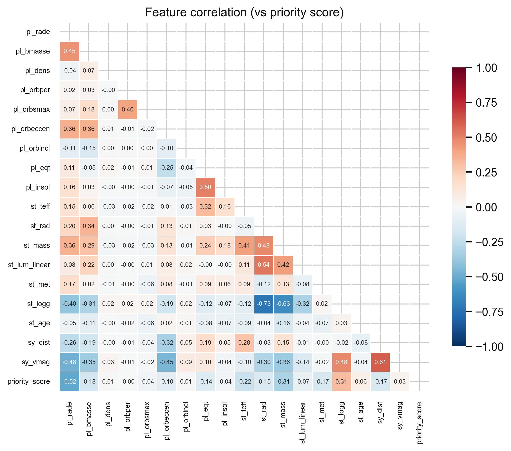<br><sub>Feature Correlation Matrix (31 features)</sub></td>
</tr>
</table>

---

## Stage 2 — Adaptive Scheduling Engine

### 5 Schedulers

| Scheduler | Strategy | Role |
|-----------|----------|------|
| **Static Priority** | Always top priority_score | Baseline 1 |
| **Detectability Greedy** | Always top detectability | Baseline 2 |
| **Uncertainty Greedy** | Always highest uncertainty | Baseline 3 |
| **Adaptive Scheduler** | `Utility = (Gain × F) / Cost` | **Our method** |
| **Oracle** | Perfect future knowledge | Upper bound for regret |

### Key Formulas

**Scientific Gain with time-decaying exploration:**
```
Gain_i = α_t · U_i + β_t · P_i + γ · D_i

β_t = β_0 · exp(-t / τ)    ← early exploration → late exploitation
```

**Scheduling Utility:**
```
Utility_i = (Gain_i × Feasibility_i) / Cost_i
```

**Oracle Regret:**
```
Regret@t = (Oracle_cumgain_t − Scheduler_cumgain_t) / Oracle_cumgain_t
```

**Observation Noise (realistic, closed-loop feedback):**
```
σ_new = σ_old × (0.4 + 0.4·D + 0.2·w) / √n_obs
```

**AR(1) Weather Model:**
```
w_t = ρ · w_{t-1} + (1-ρ) · Beta(5,2) + noise,  ρ = 0.65
```

### Campaign Diversity Metric (5 dimensions)

| Dimension | Measure |
|-----------|---------|
| Stellar Type Entropy | Shannon H over OBAFGKM distribution |
| Temperature Diversity | std(T_eq) / max(T_eq) |
| Orbital Diversity | std(log P) / mean(log P) |
| Mass Diversity | std(log M) / mean(log M) |
| Distance Coverage | std(d) / median(d) |

### Stage 2 Empirical Evaluation Results

Five schedulers were simulated over a **30-round campaign (300 observations total)** under visibility constraints, AR(1) weather perturbations, and realistic integration exposure limits. Schedulers are ranked by the **Multi-Objective Composite Campaign Score**:

$$\text{CompositeScore} = 0.35 \cdot G_{\text{norm}} + 0.25 \cdot D_{\text{norm}} + 0.20 \cdot E_{\text{norm}} + 0.20 \cdot P_{\text{norm}}$$

| Rank | Scheduler | Composite Score | Cum. Gain | Regret | Diversity | Priority Coverage | Telescope Util. | Obs. Eff. | Mean $\sigma$ Reduc. | Observed Planets | Telescope Hours |
|:---:|---|:---:|:---:|:---:|:---:|:---:|:---:|:---:|:---:|:---:|:---:|
| 1 | **Oracle (ceiling)** | **100.00%** | 5.7391 | 0.0000 | 0.6003 | 0.7746 | 94.6% | 0.0253 | 0.0204 | 236 | 227.0 |
| 2 | **Adaptive Scheduler** | **99.87%** | 5.7872 | 0.0000 | 0.5992 | 0.7713 | 95.0% | 0.0254 | 0.0200 | 237 | 228.0 |
| 3 | **Detectability Greedy** | 95.55% | 6.4366 | 0.0000 | 0.5537 | 0.6776 | 96.6% | 0.0277 | 0.0179 | 188 | 231.8 |
| 4 | **Static Priority** | 80.40% | 3.9961 | 0.3037 | 0.5344 | 0.9854 | 95.3% | 0.0174 | 0.0630 | 174 | 228.8 |
| 5 | **Uncertainty Greedy** | 66.05% | 3.0187 | 0.4740 | 0.4767 | 0.6723 | 95.3% | 0.0132 | 0.0989 | 143 | 228.8 |

*   **Adaptive Scheduler** achieves **99.87%** of the theoretical Oracle performance, balancing information gain, high target diversity, and execution efficiency near-perfectly.
*   **Single-Objective Baselines** exhibit severe pathologies: *Detectability Greedy* targets easy-to-observe gas giants in close orbits (mini-Neptunes) but completely neglects scientific value and target diversity; *Static Priority* over-exploits high-priority targets, wasting telescope hours during unfavorable weather.

### Stage 2 Telemetry & Evaluation Plots

<table>
<tr>
<td>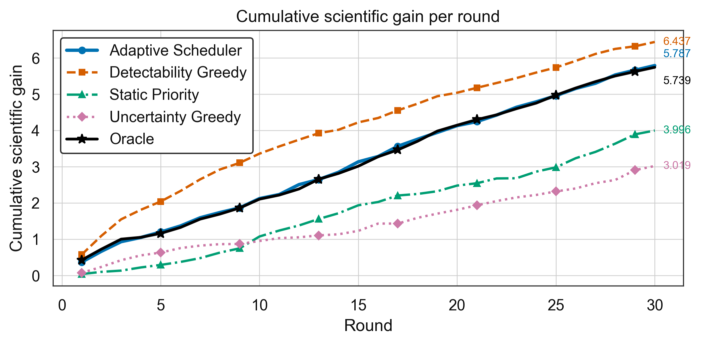<br><sub>Cumulative Scientific Gain over 30 rounds</sub></td>
<td>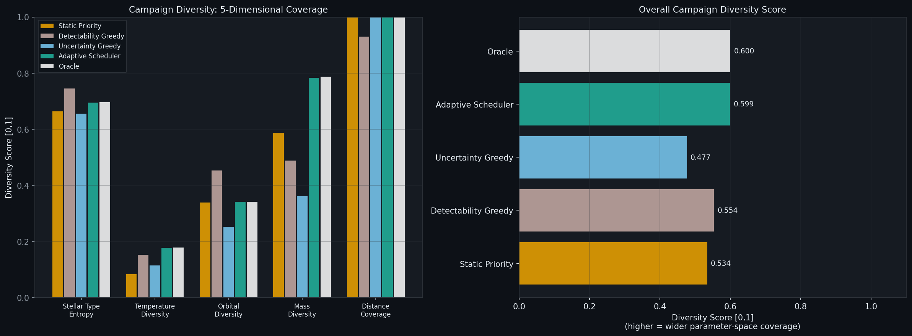<br><sub>Campaign Parameter-Space Diversity (5 dimensions)</sub></td>
</tr>
<tr>
<td>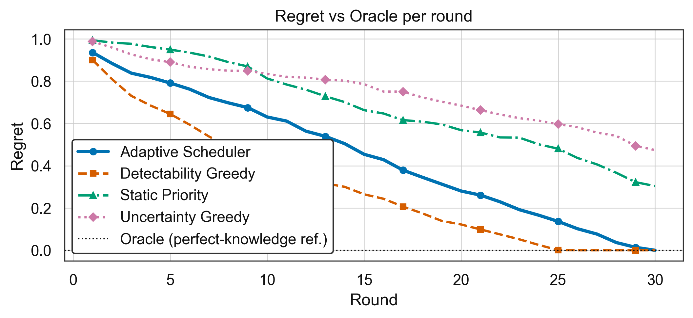<br><sub>Dynamic Scheduler Regret relative to Oracle</sub></td>
<td>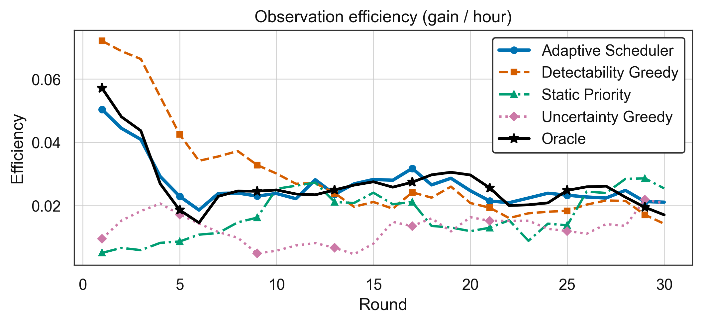<br><sub>Observation Efficiency (scientific gain per hour)</sub></td>
</tr>
<tr>
<td><br><sub>Dynamic Pareto Frontier in Gain vs. Diversity space</sub></td>
<td>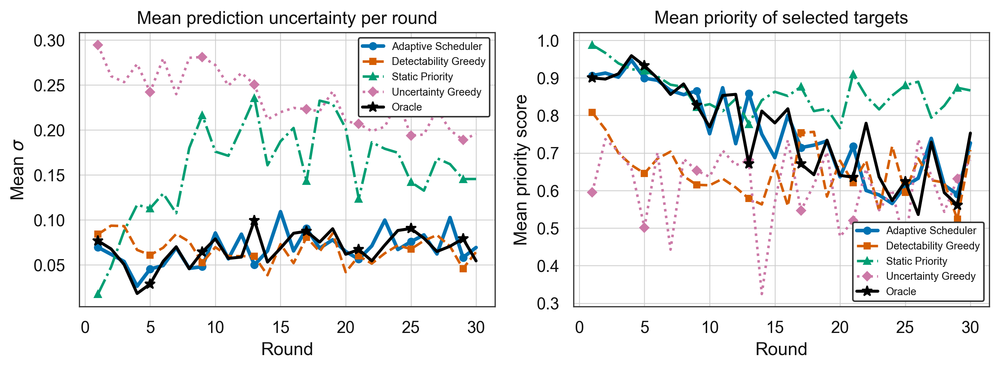<br><sub>Evolution of Prediction Uncertainty & Selected Target Priority</sub></td>
</tr>
<tr>
<td>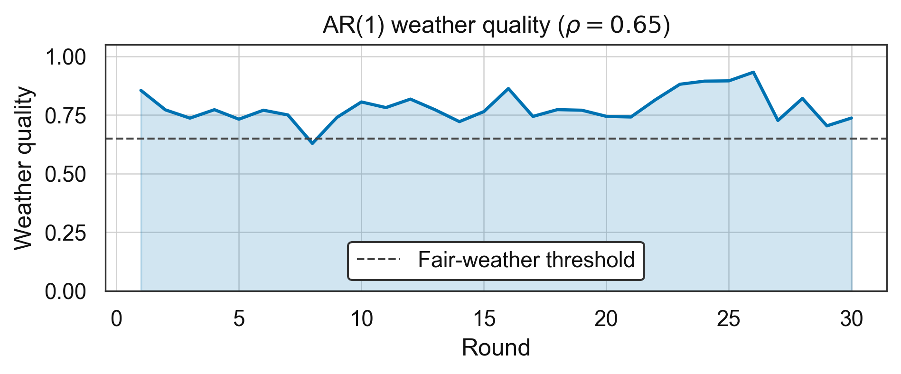<br><sub>Generated AR(1) Weather and Visibility Quality Sequence</sub></td>
<td>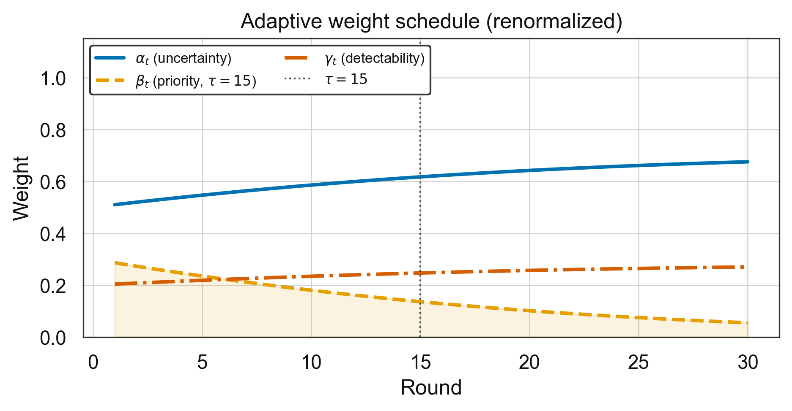<br><sub>Dynamic Exponential Weight Decay ($\alpha_t, \beta_t$) Sequence</sub></td>
</tr>
</table>

---

## Interactive 3D Web Dashboard

We have developed a state-of-the-art **Interactive 3D Web Dashboard** (`dashboard/index.html`) using HTML5, CSS3, Vanilla JavaScript, **Three.js** (for 3D graphics), and **Plotly.js** (for dynamic plotting). The dashboard runs fully **offline** (`file:///` protocol) by embedding pre-serialized telemetry directly in `data_store.js`, completely bypassing browser CORS blockages.

### High-Impact Features

1.  **Live Reprioritization Animation ⭐⭐⭐⭐⭐**
    *   Watch exoplanets reorder in real-time inside the campaign leaderboard. As rounds advance, planet rows dynamically swap vertical positions using smooth CSS flex transitions to reflect priority score updates.
2.  **AI Reasoning Panel ⭐⭐⭐⭐⭐**
    *   Exposes explainable scientific AI decision-making. Select any target and see an instant mathematical "+/-" breakdown of why it was chosen (e.g. `+ High uncertainty reduction potential`, `+ Favorable detectability`, `- Transition overhead`).
3.  **Exploration vs. Exploitation Gauge ⭐⭐⭐⭐**
    *   Shows real-time gauges representing the dynamic trade-off mix. Watch the schedule shift live from exploratory scans in early rounds to focused target exploitation as uncertainties shrink.
4.  **Sky Map / Galactic View ⭐⭐⭐⭐**
    *   Toggles between a local 3D Keplerian orbital view and a beautiful Milky-Way-style galactic target distribution map. Renders star systems as color-coded coordinates mapping active priority hotspots.
5.  **Scientific Discovery Feed ⭐⭐⭐⭐⭐**
    *   A live, terminal-style news ticker displaying scheduler events (e.g. `[Round 12] Shifted scheduling bias toward underexplored K-type systems due to rapid uncertainty reduction`).
6.  **Campaign Replay System ⭐⭐⭐⭐**
    *   A comprehensive playback toolbar with controls (Play, Pause, Reset, Fast Forward) and a round slider (1 to 30) letting users scrub through the campaign to watch parameters evolve.
7.  **Multi-Telescope Operations ⭐⭐⭐⭐⭐**
    *   Simulates coordinated observations between **JWST**, a **Ground-Based Observatory**, and a **Survey Telescope (TESS-like)**, displaying live telescope utilization and wavelength indicators.
8.  **Scientific Gain Heatmap ⭐⭐⭐⭐**
    *   Renders equilibrium temperature ($T_{\text{eq}}$) vs. planetary radius ($R_{\text{p}}$) colored by parameter-space uncertainty. Watch uncertainty hotspots extinguish in real-time as targets are scheduled.
9.  **Dynamic Pareto Frontier ⭐⭐⭐⭐**
    *   Plots schedulers in the Cumulative Gain vs. Campaign Diversity space. Watch the scheduler nodes trace their optimization trajectories toward the optimal boundary in real-time.
10. **Physical Sound Design (Web Audio API) ⭐⭐⭐⭐⭐**
    *   Synthesizes live high-fidelity chimes (radar pings on acquisitions, data ticks, and arpeggiated success chords) using pure HTML5 oscillators, ensuring offline compatibility.

### Running the Dashboards

#### 1. Interactive 3D Web Dashboard (Recommended)
Simply open the dashboard file directly in any web browser! No installation, server, or internet connection required:
*   Double-click `dashboard/index.html` or open `file:///D:/PEOJECTS/water/dashboard/index.html` in your browser.

#### 2. Companion Streamlit Dashboard
If you prefer a Python-driven dashboard, a complete Streamlit panels interface is included:
```bash
pip install streamlit plotly
streamlit run dashboard/app.py
```

---

## Scientific Formulations

**Priority Score (weak supervision, v2.1):**

$$\text{priority} = \frac{(H+\varepsilon)^{0.5}(R+\varepsilon)^{0.3}(E+\varepsilon)^{0.2} + \text{diversity nudges}}{1} \xrightarrow{\text{quantile}} \mathcal{U}[0,1]$$

**Habitable Zone (Kopparapu et al. 2014):**

$$S_{eff} = S_{eff\odot} + aT_* + bT_*^2 + cT_*^3 + dT_*^4, \quad d_{HZ} = \sqrt{L_\star / S_{eff}}$$

**Uncertainty (tree variance):**

$$\sigma_i = \text{std}\left(\hat{y}^{(1)}_i, \ldots, \hat{y}^{(N)}_i\right)$$

**Stage 3 RL Reward (upcoming):**

$$R_t = \Delta\text{InformationGain}_t - \lambda \cdot \text{ObservationCost}_t$$

---

## ML Features (31 total — leakage-free)

| Category | Features |
|----------|----------|
| Planet physics | radius, mass, density, orbital period, semi-major axis, eccentricity, inclination, T_eq, insolation |
| Stellar physics | T_eff, radius, mass, luminosity, metallicity, log g, age |
| Distance/brightness | system distance, V-mag, J-mag |
| Observation feasibility | SNR proxy, distance penalty, transit depth, duration, detectability |
| Spectral type (one-hot) | O, B, A, F, G, K, M |

> **Leakage prevention:** `hz_factor`, `esi`, `_diag` components excluded from ML features — used only in weak supervision label construction.

---

## Project Structure

```
water/
├── habitability_predictor.ipynb   # Stage 1: Main Colab notebook
├── stage2_pipeline.ipynb          # Stage 2: Scheduling campaign notebook
├── src/
│   ├── data_acquisition.py        # NASA API, feature engineering, v2.1 priority score
│   ├── ml_pipeline.py             # Ensemble models, ranking metrics, uncertainty
│   ├── constraint_engine.py       # AR(1) weather, time budget, visibility, cost
│   ├── observation_simulator.py   # SNR/weather/detectability-dependent noise model
│   ├── scheduler.py               # 5 schedulers + OracleScheduler + campaign runner
│   └── evaluation.py              # 7 metrics, comparison table, 7 plots
├── dashboard/
│   ├── index.html                 # 3D Interactive Web Dashboard (HTML5, JS, CSS)
│   ├── main.js                    # Controller: Three.js planetarium, Plotly logic, synthesizer
│   ├── style.css                  # Premium dark-mode glassmorphic CSS styling
│   ├── data_store.js              # Pre-packaged campaign results (bypasses CORS blocks)
│   ├── app.py                     # Streamlit 5-panel companion dashboard
│   └── requirements.txt
├── data/
│   ├── exoplanets_processed.csv   # 5,522 ML-ready planets
│   ├── final_priority_ranking.csv # Ranked telescope targets
│   ├── s2_*_logs.csv              # Stage 2 campaign scheduler telemetry logs
│   └── stage2_comparison.csv      # Unified Stage 2 metrics comparison
├── plots/                         # 18 generated telemetry plots (Stage 1 + Stage 2)
├── models/                        # Saved trained ML models
├── report/
│   ├── main.tex                   # Full LaTeX technical report (Section 10 updated)
│   └── references.bib
└── .gitignore
```

---

## Roadmap

| Stage | Status | Description |
|-------|--------|-------------|
| **Stage 1** | ✅ Complete | Static ML Ranking — 4 models, SHAP, uncertainty, temporal simulation |
| **Stage 2** | ✅ Complete | Adaptive Scheduling — 5 schedulers, Oracle regret, Campaign Diversity, 3D Dashboard |
| **Stage 3** | 🔄 In Progress | RL Scheduler — MaskablePPO + BC pretraining + LinUCB Bandit + Curriculum |

---

## Stage 3 — Reinforcement Learning Autonomous Scheduler

### Environment: `ExoplanetSchedulingEnv(gym.Env)`

The RL environment wraps the entire Stage 2 simulation stack inside a standard Gymnasium interface compatible with Stable-Baselines3.

**State Space** (flat Box, 6×N + 10 dimensions):
| Feature | Description |
|---|---|
| `priority_mu` × N | Current estimated priority scores |
| `uncertainty_sigma` × N | Current prediction uncertainties |
| `detectability` × N | Physical detectability scores |
| `cost_norm` × N | Normalised observation costs |
| `observed_flag` × N | Binary: already observed this campaign? |
| `visibility_flag` × N | Binary: currently visible this round? |
| `weather` | AR(1) weather quality [0,1] |
| `budget_remaining` | Remaining hours / max hours |
| `round_frac` | Round progress fraction |
| `diversity_state[0..5]` | Stellar-type coverage fractions |

**Action Space**: `Discrete(N_CANDS)` — select one target from the pre-filtered shortlist.

**Candidate Pre-Filtering**: 5,522 → 100 planets via composite score:
```
shortlist_score = 0.40 × priority + 0.35 × uncertainty + 0.25 × detectability
```

### Reward Function

$$R_t = 0.35 \cdot G_{\text{norm}} + 0.25 \cdot D_{\text{norm}} + 0.20 \cdot E_{\text{norm}} + 0.20 \cdot P_{\text{norm}}$$

Each component normalized **independently** via RunningMeanStd (prevents dominance). Diversity uses **EMA-smoothed entropy increment** for training stability.

| Component | Formula |
|---|---|
| G (Information Gain) | `(σ_before − σ_after) × detectability` |
| D (Diversity) | EMA-smoothed stellar-type entropy increment |
| E (Efficiency) | `G / cost_hrs` |
| P (Priority Coverage) | True ground-truth priority of selected planet |

**Penalties**: Over-budget (−0.50), Redundant re-obs (−0.20), Low detectability (−0.10), Invalid action (−0.30)

### Algorithms

| Algorithm | Type | Key Feature |
|---|---|---|
| **MaskablePPO** | Deep RL | Action masking + entropy regularization + BC warm-start |
| **LinUCB Bandit** | Contextual Bandit | Interpretable, sample-efficient, closed-form update |

### Curriculum Training Protocol

```
Phase 1: 10-planet env   → 10k steps  (fast convergence, reward structure learning)
Phase 2: 50-planet env   → 30k steps  (intermediate complexity)
Phase 3: 100-planet env  → 60k steps  (full; Behavior Cloning warm-start from Adaptive Scheduler)
```

**Behavior Cloning**: PPO policy pre-trained on AdaptiveScheduler trajectories (imitation → RL fine-tuning). Massively stabilizes early-stage learning.

### Stage 3 RL Visualizations (7 plots)

| Plot | File | Description |
|---|---|---|
| Training Reward Curve | `s3_training_reward_curve.png` | Episode reward + running mean vs episodes |
| Policy Heatmap | `s3_policy_heatmap.png` | T_eq × Radius space colored by RL selection frequency |
| Reward Decomposition | `s3_reward_decomposition.png` | Stacked area: G/D/E/P components per round |
| Exploration Timeline | `s3_exploration_timeline.png` | New targets vs revisits per round |
| Extended Pareto | `s3_pareto_extended.png` | Stage 2 Pareto + PPO + LinUCB nodes |
| Generalization | `s3_generalization.png` | Robustness across 4 weather seeds |
| State t-SNE | `s3_state_tsne.png` | State embeddings colored by reward quartile |

---


## Running on Google Colab

**Stage 1:**
1. Open `habitability_predictor.ipynb` via GitHub in Colab
2. Add `GITHUB_TOKEN` to Colab Secrets
3. Run all cells — results auto-push to GitHub

**Stage 2:**
1. Open `stage2_pipeline.ipynb` via GitHub in Colab
2. Run all cells — campaigns, evaluation, plots auto-generated
3. Launch dashboard: `!streamlit run dashboard/app.py &`

**Local setup:**
```bash
git clone https://github.com/rushikesh-D69/water.git
cd water
pip install xgboost lightgbm shap scipy scikit-learn matplotlib seaborn \
            requests joblib streamlit plotly
jupyter lab stage2_pipeline.ipynb
```

---

## Data Source

- **NASA Exoplanet Archive** — [exoplanetarchive.ipac.caltech.edu](https://exoplanetarchive.ipac.caltech.edu)
- Table: `pscomppars` (Planetary Systems Composite Parameters)
- Access: TAP API with ADQL
- Coverage: 6,284 confirmed exoplanets → 5,522 after processing

---

## References

1. Kopparapu et al. (2013, 2014) — Habitable zone boundaries
2. Chen & Kipping (2017) — Mass-radius empirical relations
3. Schulze-Makuch et al. (2011) — Earth Similarity Index (ESI)
4. Lundberg & Lee (2017) — SHAP unified feature attribution
5. Chen & Guestrin (2016) — XGBoost
6. Ke et al. (2017) — LightGBM
7. Breiman (2001) — Random Forests
8. Järvelin & Kekäläinen (2002) — NDCG metric

---

## Target Publication Venues

- IEEE AI for Science workshops
- Springer Lecture Notes in Computer Science (AI/Astronomy)
- IJCAI / AAAI workshops on AI for Physical Sciences
- Monthly Notices of the Royal Astronomical Society (computational track)
